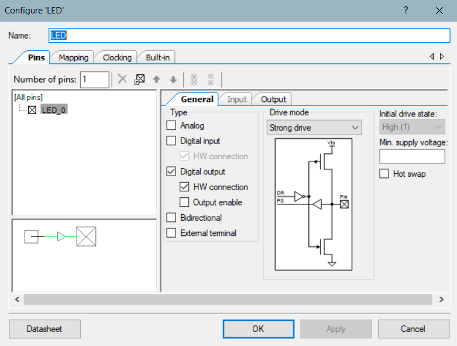

## Introduction
This tutorial guides you through the process of creating a web application using HTML, CSS, and JavaScript to establish bidirectional communication with a PSoC device. By following these steps, you'll learn how to build a responsive web interface for seamless interaction with PSoC hardware.

### Prerequisites
1. [HTML](https://www.w3schools.com/html/) - Hypertext Markup Language 
2. [CSS](https://www.w3schools.com/css/default.asp) - Cascading Style Sheets
3. [JavaScript](https://www.w3schools.com/js/default.asp)

### Limitations of the Web App
1. Compatible with Windows: Tested on Chrome.
2. Limited on Android, iOS, Mac: Not recommended

## PSoC Setup
### Top Design and component configuration
Add the following components in the Top Design of the PSoC Creator.


#### PWM subsystem
1. PWM subsystem is used to control the On and Off time of the LED.
2. Connect 1kHz clock signal.
3. Connect a digital pin to the 'line_n' pin of the PWM subsystem and name the pin as needed.
4. Select pin type as Digital output and HW connection.
5. Select drive mode as Strong drive.




#### ADC subsystem
1. ADC is used to convert analog values from a sensor into digital values.
2. In this tutorial a potentiometer is used. However, it could be replaced with an analog sensor based on the need.
3. Add an analog pin to the positive terminal of the ADC.
4. Set the initial drive state of the analog pin to High(1).
5. In the general tab of the ADC configuration, select Vref as VDDA and Single ended negative input as Vss.
6. In the channels tab of the ADC configuration, select the Sequenced channels as 1 and the mode of channel 0 as Single.


#### UART subsystem
1. A UART subsystem is used for debugging and displaying the message received from the text box in the application.
2. Mode is set to Full UART (TX+RX).
3. Bits per second is set to 57600 and data bits as 8. The remaining parameters are the same as default.


#### BLE subsystem
1. In the General tab in the configuration window, set the profile as Custom
2. Select Server (GATT Server) in the profile role and Peripheral in the GAP role.
 


3. In the Profiles tab, click on Server role and add service. The service name in our case is LED


4. Now click on the LED service and add characteristics. This tutorial has four characteristics added namely CONTROL, VALUEREAD, VALUEREADFLAG, FORMDATA.


5. Click on each of the characteristics to select the properties.
6. For the characteristics CONTROL, VALUEREADFLAG, and FORMDATA select only the WriteWithoutResponse property


7. For the VALUEREAD characteristic, select Read, Notify, and Indicate properties.


8. In the GAP Settings tab, check the box Silicon generated "Company assigned" part of device address.
9. And change the device name for unique identity.


### Pin names and connections
In the previous section you successfully completed the configuration of the components in the Top Design. Now you can assign pins to your PSoC.

Assign pins to the ports as follows:
1. LED -> P2[6]
2. Pot_Output -> P1[0]
3. Rx_1 -> P1[4]
4. Tx_1 -> P1[5]


### PSoC Code
[!NOTE]
As mentioned before, the PSoC code is developed to receive data from the web app for controlling LED, subscribe/unsubscribe sensor data notifications/indications and text box data. Notifications/indications will be sent to the web app based on the sensor_data_flag status. You can always modify the code to include more subsystems and BLE characteristics.

1. Include the header files
```
#include "project.h"
#include "stdio.h"
```

2. Declare a BLE connection handle and global variable for sensor data flag which will be used for turning the notifications/indications On and Off.
```
CYBLE_CONN_HANDLE_T cyBle_connHandle; // Declare a connection handle
int sensor_data_flag = 0;  // declare a global variable which will be used for notifications and indications
```
3. Define the Stack_Handler function to handle all the BLE events
```
void Stack_Handler(uint32 eventCode, void* eventParam)
{
    // Pointer to a structure holding parameters for a GATT Server write request
    CYBLE_GATTS_WRITE_REQ_PARAM_T *writeReqParam; 
    
    switch(eventCode)
    {
        // starting advertising once the stack is turned ON
        case CYBLE_EVT_STACK_ON:
        case CYBLE_EVT_GAP_DEVICE_DISCONNECTED:
            CyBle_GappStartAdvertisement(CYBLE_ADVERTISING_FAST);
            break;
        case CYBLE_EVT_GATTS_WRITE_CMD_REQ:
            // Casting the eventParam to a pointer of type CYBLE_GATTS_WRITE_REQ_PARAM_T
            writeReqParam = (CYBLE_GATTS_WRITE_REQ_PARAM_T *)eventParam;
            
            // if the attribute handle equals LED_CONTROL characterisic, enter this condition
            if(writeReqParam->handleValPair.attrHandle == CYBLE_LED_CONTROL_CHAR_HANDLE)
            {
                if(writeReqParam->handleValPair.value.val[0] == 'a')
                {
                    PWM_WriteCompare(0); // LED is off
                }
                else if(writeReqParam->handleValPair.value.val[0] == 'b')
                {
                    PWM_WriteCompare(500); // LED turns on and off every 500ms
                }
                else if(writeReqParam->handleValPair.value.val[0] == 'c')
                {
                    PWM_WriteCompare(1000); // LED turns on
                }
                // Write the attribute value. Required only when a response to the write request is needed.
                // In our case, we are writing without response
                //CyBle_GattsWriteAttributeValue(&writeReqParam->handleValPair, 0, &cyBle_connHandle, CYBLE_GATT_DB_LOCALLY_INITIATED);
            }
            // if the attribute handle equals LED_VALUEREADFLAG characterisic, enter this condition
            if(writeReqParam->handleValPair.attrHandle == CYBLE_LED_VALUEREADFLAG_CHAR_HANDLE)
            {
                if(writeReqParam->handleValPair.value.val[0] == 'e')
                {
                    sensor_data_flag = 'e';  // update flag to send notifications or indications
                }
                else
                {
                    sensor_data_flag = 0;  // update flag to unsubscribe to the sensor data
                }
                // Write the attribute value. Required only when a response to the write request is needed.
                // In our case, we are writing without any response
                //CyBle_GattsWriteAttributeValue(&writeReqParam->handleValPair, 0, &cyBle_connHandle, CYBLE_GATT_DB_LOCALLY_INITIATED);
            }
            // if the attribute handle equals LED_FORMDATA characterisic, enter this condition
            if(writeReqParam->handleValPair.attrHandle == CYBLE_LED_FORMDATA_CHAR_HANDLE)
            {
                // Prints the data received from the text box in the application.
                char form_data[300]={0};
                for(int i=0; i<writeReqParam->handleValPair.value.len; i++)
                {
                    form_data[i] = writeReqParam->handleValPair.value.val[i];
                }
                sprintf(form_data, "%s", form_data);
                UART_1_PutString(form_data);
                UART_1_PutChar('\n');
                UART_1_PutChar('\r');
            }
            //Send a response to the write request.
            // In our case, we are writing without response
            //CyBle_GattsWriteRsp(cyBle_connHandle);
            break; 
        default:
            break;
    }
}
```
4. Define the main function to initialize the global interrupts, start all the subsystems, process BLE events and notify/indicate sensor data.
```
int main(void)
{
    CyGlobalIntEnable; // Enable global interrupts.
    
    UART_1_Start();
    
    ADC_1_Start();
    
    ADC_1_StartConvert();

    PWM_Start();
    
    CyBle_Start(Stack_Handler);
    
    // declare and initialize variables for sensor data
    uint8 SensorValue;
    uint8 PreviousValue = -100;
    
    
    for(;;)
    {
        CyBle_ProcessEvents();  // process BLE events in each iteration
        
        ADC_1_IsEndConversion(ADC_1_WAIT_FOR_RESULT);
              
        // can be replaced with a sensor. Right now a potentiometer is being used
        if(sensor_data_flag=='e')
        {
            SensorValue = ADC_1_GetResult16(0);
            
            // Uncomment for sending notifications
            /*CYBLE_GATTS_HANDLE_VALUE_NTF_T readResponse;
            readResponse.attrHandle = CYBLE_LED_VALUEREAD_CHAR_HANDLE;
            readResponse.value.len = 1;
            readResponse.value.val = &SensorValue;  // Set the desired value here*/
            
            // Set up the indicationHandle with the appropriate attribute handle and value
            CYBLE_GATTS_HANDLE_VALUE_IND_T indicationHandle;
            indicationHandle.attrHandle = CYBLE_LED_VALUEREAD_CHAR_HANDLE;
            indicationHandle.value.val = &SensorValue; // Your data
            indicationHandle.value.len = 1; // Length of your data
            
            //CyBle_GattsWriteAttributeValue(&readResponse, 0, &cyBle_connHandle, 0);  // Write the attribute value
            CyBle_GattsWriteAttributeValue(&indicationHandle, 0, &cyBle_connHandle, 0);  // Write the attribute value

                                 
            if(1){
                // uncomment for sending notifications
                //CyBle_GattsNotification(cyBle_connHandle, &readResponse); // Send a notification
                CyBle_GattsIndication(cyBle_connHandle, &indicationHandle); // Send an indication
                PreviousValue = SensorValue;
            }
        }
    }   
}
```

## User Interface
The user interface consists of three main components: HTML, CSS, JavaScript.

* [HTML](https://www.w3schools.com/html/) - Standard markup language for creating UI elements of web pages and web applications.
+ [CSS](https://www.w3schools.com/css/default.asp) - Describes how HTML elements are to be displayed on screen.
- [JavaScript](https://www.w3schools.com/js/default.asp) - JavaScript is a scripting language used to create and control dynamic website content. It provides functionality to the UI elements created using HTML.

This is how your final web app looks like after hosted in github.


Before moving on to the coding part, you can click on the [link](https://s-nithish-kumar.github.io/BLE_web_app/) to open the web app hosted in github and check the app functionalities with your PSoC programmed. 

#### Tips
1. Use VS code for creating HTML, CSS, Javascript files. VS code has extenstion which will help you auto complete some keywords.
2. Additionally, it has an extension for live server allowing you to view your website locally. This will be helpful during the development phase of your website where you can host your website locally and test out the functionalities.
3. To install live server click on extensions and search for live server. It will show a list of extensions choose the one which is in the image below and install it.


4. To open your live server, right click on your HTML code and click Open with Live Server 


5. Your website will be hosted locally on your default browser (recommended browser: Chrome)


### HTML
[HTML](https://www.w3schools.com/html/) - Hypertext Markup Language
1. Specify the document type and language
```
<!DOCTYPE html>
<html lang="en">
```

2. In the header tag include the bootstrap resource links, stylesheet link, title of the page, and view port configuration.
```
<head>
    <meta charset="utf-8">
    <meta name="viewport" content="width=device-width, initial-scale=1">
    <link rel="stylesheet" href="https://maxcdn.bootstrapcdn.com/bootstrap/3.4.1/css/bootstrap.min.css">
    <script src="https://ajax.googleapis.com/ajax/libs/jquery/3.6.4/jquery.min.js"></script>
    <script src="https://maxcdn.bootstrapcdn.com/bootstrap/3.4.1/js/bootstrap.min.js"></script>
    <link href="styles.css" rel="stylesheet">
    <title>BLE Web App</title>
</head>
```

3. The body tag contains the UI elements. In this tutorial, the UI page is divided into five div tags.

4. The first div tag contains the title of the app.
```
<body>
    <div class="flex-container-heading">
        <p style="font-size: 25px;">Simple Web App<br>PSoC Control Using BLE</p>
    </div>
```

5. The second div tag contains the buttons for connecting and disconnecting the BLE device.
```
<div class="row" style="margin-bottom: 15px;">
        <div class="col-sm-4"></div>
        <div class="col-sm-4">
            <div class="flex-container-top">
                <button id="connect" type="button" class="flex-container-button"
                    style="background-color: rgb(127, 255, 138);">Connect</button>
                <button   id="disconnect" type="button" class="flex-container-button"
                    style="background-color: rgb(226, 43, 43);">Disconnect</button>
            </div>
            <div class="flex-container-bottom" style="flex-direction: column; padding-left: 10px;">
                <h4>Connection Datalog</h4>
                <div id="datalog"></div>
            </div>
        </div>
        <div class="col-sm-4"></div>
    </div>
```

6. The third div tag contains the buttons for subscribing and unsubscribing sensor data and display the sensor values.
```
<div class="row" style="margin-bottom: 15px;">
        <div class="col-sm-4"></div>
        <div class="col-sm-4">
            <div class="flex-container-top"
                style="justify-content: space-around; align-items:center ; flex-direction: column;">
                <h4>Sensor Data From PSoC</h4>
                <div id="dataFromBle"></div>
            </div>
            <div class="flex-container-bottom">
                <button  id="subscribe" type="button" class="flex-container-button"
                    style="background-color: rgb(255, 161, 46);">Subscribe</button>
                <button   id="unsubscribe" type="button" class="flex-container-button"
                    style="background-color: rgb(255, 161, 46);">Unsubscribe</button>
            </div>
        </div>
        <div class="col-sm-4"></div>
    </div>
```

7. The fourth div tag contains the buttons for controlling LED.
```
    <div class="row" style="margin-bottom: 15px;">
        <div class="col-sm-4"></div>
        <div class="col-sm-4">
            <div class="flex-container-top" style="justify-content: center; padding-left: 10px;">
                <h4>LED Control</h4>
            </div>
            <div class="flex-container-bottom-control" style="justify-content: space-around;">
                <button   id="no_alert" type="button" class="flex-container-control-button">No
                    alert</button>
                <button   id="mild_alert" type="button" class="flex-container-control-button">Mild
                    alert</button>
                <button   id="high_alert" type="button" class="flex-container-control-button">High
                    alert</button>
            </div>
        </div>
        <div class="col-sm-4"></div>
    </div>
```

8. The fifth div tag contains the text box for sending message to PSoC.
```
    <div class="row">
        <div class="col-sm-4"></div>
        <div class="col-sm-4">
            <div class="flex-container-top" style="justify-content: center; padding-left: 10px;">
                <h4>Send data to PSoC</h4>
            </div>
            <div class="flex-container-bottom-control" style="justify-content: center;">
                <form id="send-form" class="form">
                    <input id="input" type="text" style="font-size: 20px; width: 200px; margin-bottom: 10px;">
                    <button   type="submit" class="flex-container-control-button">Send</button>
                </form>
            </div>
        </div>
        <div class="col-sm-4"></div>
    </div>
    <script src="main.js"></script>
</body>
</html>
```

### CSS
[CSS](https://www.w3schools.com/css/default.asp) - Cascading Style Sheets

* The visual appeal of the UI elements created using HTML are enhanced using CSS.
+ class selectors are used to specify the properties of the UI elements.
- CSS media query is used to define a set of rules for varying screen sizes which makes the web app responsive. You can change the window size to view the alignment changes of the UI elements.


```
.flex-container-heading {
    display: flex;
    justify-content: center;
    text-align: center;
    padding: 5px;
  }

.flex-container {
  display: flex;
  justify-content: center;
  background-color: rgb(213, 213, 213);
  border-radius: 20px;
}

.flex-container-top {
  display: flex;
  justify-content: center;
  background-color: rgb(213, 213, 213);
  border-top-right-radius: 20px;
  border-top-left-radius: 20px;
  padding-top: 10px;
  padding-bottom: 5px;
  align-items: center;
}

.flex-container-bottom {
display: flex;
justify-content: center;
background-color: rgb(213, 213, 213);
border-bottom-right-radius: 20px;
border-bottom-left-radius: 20px;
padding-bottom: 10px;
}

.flex-container-bottom-control {
  display: flex;
  justify-content: center;
  align-items: center;
  background-color: rgb(213, 213, 213);
  border-bottom-right-radius: 20px;
  border-bottom-left-radius: 20px;
  padding-bottom: 10px;
  }

.flex-container-button {
width: 140px;
text-align: center;
line-height: 40px;
font-size: 20px;
border-radius: 20px;
border-width: 2px;
margin: 5px;
}


.flex-container-control-button {
background-color: #1f7fec;
width: 130px;
margin-bottom: 10px;
text-align: center;
line-height: 0px;
font-size: 20px;
border-radius: 20px;
border-width: 2px;
flex-direction: row;
padding-top: 20px;
padding-bottom: 20px;
}

@media (max-width: 1200px) {
  .flex-container-bottom-control {
    flex-direction: column;
    justify-content: center;
    align-items: center;
  }
}

.form {
  text-align: center;
  justify-content: center;
  align-items: center;
}
```

### JavaScript
[JavaScript](https://www.w3schools.com/js/default.asp)
1. Get references to the UI elements using their Ids.
```
// Get references to UI elements

// Bluetooth connect and disconnect elements
let connectButton = document.getElementById('connect');
let disconnectButton = document.getElementById('disconnect');

// Led control elements
let no_alert_button = document.getElementById('no_alert');
let mild_alert_button = document.getElementById('mild_alert');
let high_alert_button = document.getElementById('high_alert');

// PSoC data subscribe and unsubscribe elements
let subscribe_button = document.getElementById('subscribe');
let unsubscribe_button = document.getElementById('unsubscribe');

// Form UI elements
let sendForm = document.getElementById('send-form');
let inputField = document.getElementById('input');
```

2. Initialize variables to store connection key, characteristics, and device information.
```
// initialize variables
let connectionKey = null
let characteristicCache1 = null;
let characteristicCache2 = null;
let characteristicCache3 = null;
let characteristicCache4 = null;
let deviceCache = null;
```

3. Execute the following functions on click of the Connect button
```// Handle connectButton click event.
connectButton.addEventListener('click', function () {
  connectionKey = connect() // Connect to the device on Connect button click
  publishData(connectionKey);
  subscribeData(connectionKey);
  subscribeDataFlag(connectionKey);
  FormData(connectionKey);
  console.log("completed connecting");
});
```

4. First the connect function is called which checks for the device cache. If the device cache is not equal to null then the promise is resolved or else the requestBluetoothDevice function is called.
```
// Launch Bluetooth device chooser and connect to the selected device
function connect() {
  return (deviceCache ? Promise.resolve(deviceCache) :
    requestBluetoothDevice()).
    then(device => connectDeviceAndCacheCharacteristic(device)).
    catch(error => log(error));
}
```

5. The requestBluetoothDevice function will search for the BLE device listed in the navigator.bluetooth.requestDevice function. The service id should be mentioned in the optional services for later access.
```
// Search BLE devices and assign device to deviceCache
function requestBluetoothDevice() {
  log('Requesting bluetooth device...');

  return navigator.bluetooth.requestDevice({
    filters: [{
      name: 'PSoC Controller'
    }],
    optionalServices: ['00004ba4-0000-1000-8000-00805f9b34fb'] // Required to access the service later.
  }).
    then(device => {
      log('"' + device.name + '" bluetooth device selected');
      deviceCache = device;
      return deviceCache;
    });
}
```

6. Once the device is selected from step 5, the connectDeviceAndCacheCharacteristic function will be called in step 4 which will establish connection with the device.
```
// Connect to the device specified, get service
function connectDeviceAndCacheCharacteristic(device) {
  if (device.gatt.connected && characteristicCache1) {
    return Promise.resolve(characteristicCache1);
  }

  log('Connecting to GATT server...');

  return device.gatt.connect().
  then(server =>{
    log("Connected, getting primary service")
    return server?.getPrimaryService(0x4BA4);
  });
}
```

7. Now the connection key has been obtained, the next step is to get the characteristics of the service. To get all four characteristics, four functions are called from step 3.
```
// Publish data to PSoC
publishData = (connectionKey) => {
  connectionKey.then(service => {
      log('Service found, getting characteristic one');
      return service.getCharacteristic(0x75A1);
    }).
    then(characteristic => {
      log('Characteristic one found');
      characteristicCache1 = characteristic;

      return characteristicCache1;
    });
}
```

8. This function will obtain the second characteristic and adds an event listener which calls the handleCharacteristicValueChanged function on change of the characteristic value.
```
// Subscribe data to PSoC
subscribeData = (connectionKey) => {
  connectionKey.then(service => {
      log('Service found, getting characteristic two');
      return service.getCharacteristic(0xF945);
    }).
    then(characteristic2 => {
      log('Characteristic two found');
      characteristicCache2 = characteristic2;
      return characteristicCache2;
    }).
    then(characteristic2 => {
      characteristic2.addEventListener('characteristicvaluechanged', (e) => { handleCharacteristicValueChanged(e, characteristic2) });
      return characteristic2.readValue();
    });
}
```

9. The handleCharacteristicValueChanged function mentioned in the previous step prints the sensor value received on the UI.
```
// Data receiving
function handleCharacteristicValueChanged(event, data) {
  data?.readValue()
  let myData = document.getElementById("dataFromBle")
  myData.innerHTML = dataViewToDecimal(event.target.value)
}
```

10. The data received from BLE device is in dataView format and has to be converted into decimal format before displaying on the UI. The dataViewToDecimal function is called by the handleCharacteristicValueChanged function to convert dataView format to decimal format before printing.
```
// convert dataView format to decimal
function dataViewToDecimal(dataView) {
  let decimal = 0;
  let factor = 1;
  for (let i = dataView.byteLength - 1; i >= 0; i--) {
    const byte = dataView.getUint8(i);
    decimal += byte * factor;
    factor *= 256; // Multiply by 256 for each byte (2^8)
  }
  return decimal;
}
```

11. Obtain characteristic 3
```
// Flag to subscribe data from PSoC
subscribeDataFlag = (connectionKey) => {
  connectionKey.then(service => {
      log('Service found, getting characteristic three');
      return service.getCharacteristic(0x12F7);
    }).
    then(characteristic3 => {
      log('Characteristic three found');
      characteristicCache3 = characteristic3;
      return characteristicCache3;
    });
}
```

12. Obtain characteristic 4
```
// Send form data to PSoC
FormData = (connectionKey) => {
  connectionKey.then(service => {
      log('Service found, getting characteristic four');
      return service.getCharacteristic(0x507F);
    }).
    then(characteristic4 => {
      log('Characteristic four found');
      log('"' + deviceCache.name + '" bluetooth device connected');
      characteristicCache4 = characteristic4;
      return characteristicCache4;
    });
}
```

13. Call the disconnect function on the click of the disconnect button.
```
// Disconnect from the device on Disconnect button click
// call disconnect function
disconnectButton.addEventListener('click', function () {
  disconnect();
});
```

14. Disconnect from the BLE device and reinitialize the cache variables.
```
// disconnect from the BLE device
function disconnect() {
  if (deviceCache) {
    log('Disconnecting from "' + deviceCache.name + '" bluetooth device...');

    if (deviceCache.gatt.connected) {
      deviceCache.gatt.disconnect();
      log('"' + deviceCache.name + '" bluetooth device disconnected');
    }
    else {
      log('"' + deviceCache.name +
        '" bluetooth device is already disconnected');
    }
  }

  // If characteristicCache2 is valid, this line removes the event listener 
  // for the 'characteristicvaluechanged' event. The handleCharacteristicValueChanged 
  // function is the callback function that was previously registered to handle this event.
  if (characteristicCache2) {
    characteristicCache2.removeEventListener('characteristicvaluechanged',
        handleCharacteristicValueChanged);
    characteristicCache2 = null;
  }

  // set the deviceCache and the characteristic caches to null
  deviceCache = null;
  characteristicCache1 = null;
  characteristicCache3 = null;
  characteristicCache4 = null;
}
```

15. Send a string value of 'a' to the BLE device on click of the no_alert_button.
```
// Call no_alert_send function
no_alert_button.addEventListener('click', function () {
  no_alert_send();
});

function no_alert_send() {
  data = String('a');
  writeToCharacteristic(characteristicCache1, data);
  log('Sent "a" to BLE device');
}
```

16. Send a string value of 'b' to the BLE device on click of the mild_alert_button.
```
// Call mild_alert_send function
mild_alert_button.addEventListener('click', function () {
  mild_alert_send();
});

function mild_alert_send() {
  data = String('b');
  writeToCharacteristic(characteristicCache1, data);
  log('Sent "b" to BLE device');
}
```

17. Send a string value of 'c' to the BLE device on click of the high_alert_button.
```
// Call high_alert_send function
high_alert_button.addEventListener('click', function () {
  high_alert_send();
});

function high_alert_send() {
  data = String('c');
  writeToCharacteristic(characteristicCache1, data);
  log('Sent "c" to BLE device');
}
```

18. Send a string value of 'e' to the BLE device on click of the subscribe_button.
```
// call subscribe_send function on the click event of subscribe_button
subscribe_button.addEventListener('click', function () {
  subscribe_send();
});

function subscribe_send() {
  data = String('e');
  writeToCharacteristic(characteristicCache3, data);
  log('Subscription flag ON');
}
```

19. Send a string value of 'f' to the BLE device on click of the unsubscribe_button.
```
// call unsubscribe_send function on the click event of unsubscribe_button
unsubscribe_button.addEventListener('click', function () {
  unsubscribe_send();
});

function unsubscribe_send() {
  data = String('f');
  writeToCharacteristic(characteristicCache3, data);
  log('Subscription flag OFF');
}
```

20. Call send function on the occurance of submit event of the form
```
// Handle form submit event
sendForm.addEventListener('submit', function (event) {
  event.preventDefault(); // Prevent form sending
  send(inputField.value); // Send text field contents
  inputField.value = '';  // Zero text field
  inputField.focus();     // Focus on text field
});
```

21. Send function will be called on the occurance of the submit event
```
function send(data) {
  data = String(data);
 
  // check the presence of data and characteristic
  if (!data || !characteristicCache4) {
    return;
  }

  writeToCharacteristic(characteristicCache4, data);
  log('Sent ' + `'${data}'` + ' to BLE device');
}
```

22. The log function is used to display information on the UI and and is utilized in various functions throughout the code.
```
// Output to terminal
function log(data) {
  document.getElementById('datalog').innerText = data
}
```

23. The writeToCharacteristic function is called to write a value to the BLE device without response and and is utilized in various functions throughout the code.
```
// Write to the BLE device with the specific characteristic without response
function writeToCharacteristic(characteristic, data) {
  //log(data);
  characteristic.writeValueWithoutResponse(new TextEncoder().encode(data));
}
```

## Hosting the web app in Github
1. Sign in into your github account. Click on the plus symbol and new repository.


2. Provide a repository name and check the Add a README file check box.


3. This is how your github page looks after creating the repository.


4. Navigate to github pages in settings and change the branch to main.


5. Open command prompt and navigate to the folder where you have the HTML, CSS and JavaScript files in your local machine and follow the steps below to modify the folder into a local git repository.
    1. git init     # Creates git repo
    2. git status   # Files should be staged before committing. This command is used to check the stage status.
    3. git add .    # To stage all files.
    4. git status   # Check the status again.
    5. git commit -m "Add a comment here"   # commit the staged files.


6. Now you have the git repo available in your local machine. You can push the repo to github. 
    1. In the github page, click on code and copy the github repo URL
    2. In command prompt type, git pull 'Paste your github repo URL here' --allow-unrelated-histories
    3. In command prompt type, git push 'Paste your github repo URL here' main


7. This is how your repository looks like after pushing the local repository.


8. After few minutes navigate to github pages in settings and click on the URL generated to open the live site.


9. This is how the web app looks like.


10. Now you will be able to access the web app using the URL on any device.


## App testing
1. Connect a potentiometer/sensor to the PSoC.


2. Open the web app and connect to the PSoC.


3. Click on the subscribe button to read values from the potentiometer/sensor.


4. Use the alert buttons to control LED

5. Open PuTTY and configure the serial line and speed. The serial line might be different for your system. You can find the communication port in the device manager. Once configured click on open.


6. Type something in the text box and click on send.


7. The PSoC will display the message received from the web app in the PuTTY terminal.


## References
1. https://loginov-rocks.medium.com/how-to-make-a-web-app-for-your-own-bluetooth-low-energy-device-arduino-2af8d16fdbe8
2. chrome://bluetooth-internals/#adapter
3. https://forum.digikey.com/t/psoc-4-ble-simple-gap-peripheral-gatt-server-example/12857
4. https://developer.chrome.com/articles/bluetooth/
5. https://www.w3schools.com/html/
6. https://www.w3schools.com/css/default.asp
7. https://www.w3schools.com/js/default.asp